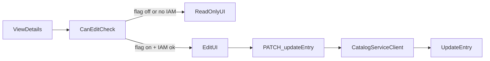
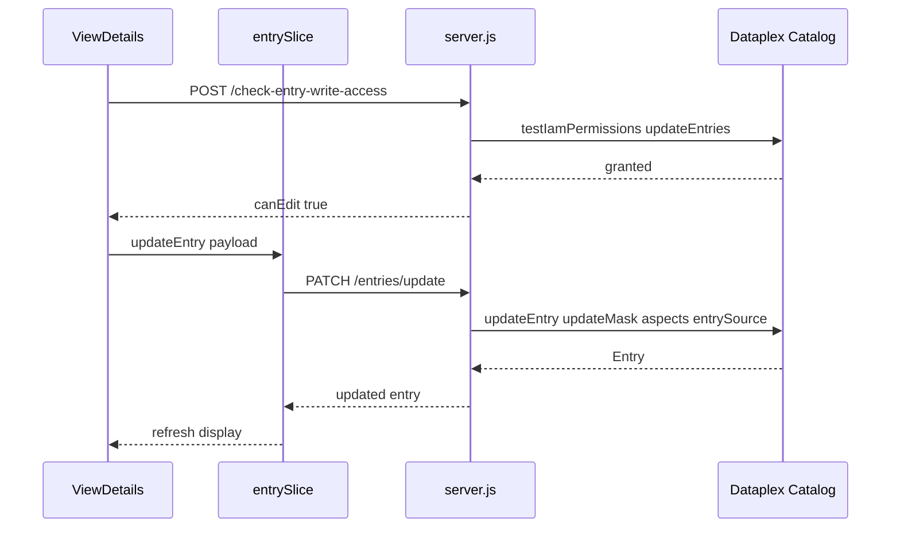

# Steward-gated UpdateEntry (aspects + overview)

## Decisions (locked)

- **V1 scope:** Edit `entrySource.displayName` / `description`, overview aspect, and custom aspects on existing entries. No create. No delete.
- **API:** `CatalogServiceClient.updateEntry` only (not `modifyEntry`).
- **Auth UX:** App entry still requires existing read IAM. Edit/Delete controls appear only when a steward feature flag is on **and** the user has write permissions for that entry’s project/entry group.
- **Delete:** Phase 2 only (document hooks; do not ship UI).

## Architecture

## Phase 1 — Backend write API

Add routes in [backend/server.js](backend/server.js) using existing `getAuthClient` / `CatalogServiceClient` patterns (same as `GET /get-entry`).

1. **`POST /api/v1/check-entry-write-access`**
   - Body: `{ entryName }` (or project + entryGroup derived from entry name).
   - Call Resource Manager / Dataplex IAM `testIamPermissions` for:
     - `dataplex.entries.update` (and optionally `dataplex.entryGroups.updateEntries` depending on how IAM is granted in the org).
   - Return `{ canEdit: boolean, permissions: string[] }`.
   - Does **not** block app login; only informs UI.

2. **`PATCH /api/v1/entries/update`** (or `POST /api/v1/update-entry` to match existing POST style)
   - Body:
     - `entryName` (required)
     - `entrySource?: { displayName?, description? }`
     - `aspects?: Record<aspectKey, Aspect>`
     - `aspectKeys: string[]` (required when touching aspects)
     - `updateMask: string[]` — e.g. `["entrySource.displayName","entrySource.description","aspects"]`
     - `deleteMissingAspects?: boolean` (default `false`; only true when steward explicitly removes listed aspects)
   - Server builds `Entry` + `UpdateEntryRequest` and calls `dataplexClientv1.updateEntry(...)`.
   - Map GCP errors: 403 → clear steward message; 400 → validation; 409/precondition → refresh-and-retry hint.
   - In **service-account mode**, writes still go through ADC; document that the Cloud Run SA needs update IAM (or disable write endpoints when SA mode is on if product wants user-attributed writes only — default: **allow SA writes** but log actor email from verified Bearer user).

3. **URL constant** in [src/constants/urls.ts](src/constants/urls.ts): `UPDATE_ENTRY`, `CHECK_ENTRY_WRITE_ACCESS`.

## Phase 1 — Auth / feature gate (no app lockout)

1. **Do not** add write permissions to [REQUIRED_PERMISSIONS](src/constants/auth.ts) (keeps viewers in).
2. Add separate constants, e.g. `STEWARD_WRITE_PERMISSIONS = ['dataplex.entries.update']`.
3. Feature flag: `VITE_FEATURE_STEWARD_EDIT=true` (frontend) — hide all edit chrome when false.
4. Optional backend kill-switch: `ENABLE_ENTRY_WRITES=true` — return 404/403 from write routes when false (safe rollout).
5. Keep `dataplex.readonly` OAuth scope for viewers; for stewards who need to edit with **user tokens**, either:
   - Rely on existing `cloud-platform` scope already in [REQUIRED_SCOPES](src/constants/auth.ts) (covers UpdateEntry), or
   - Document that stewards must not use a token limited to readonly-only custom clients.
6. Persist `canEdit` on View Details (per-entry check), not as a global “hasRole” requirement.

## Phase 1 — Frontend UX

Primary surface: [src/component/ViewDetails/ViewDetails.tsx](src/component/ViewDetails/ViewDetails.tsx).

### Overview tab
- Extend [DetailPageOverview](src/component/DetailPageOverview/DetailPageOverview.tsx): when `canEdit`, show Edit for display name / description (and overview aspect content if present as `dataplex-types.global.overview`).
- Save → `updateEntry` with mask paths for `entrySource.*` and/or overview aspect key.
- Optimistic UI optional; simplest: disable Save, await response, then `fetchEntry` refresh.

### Aspects tab
- Extend [PreviewAnnotation](src/component/Annotation/PreviewAnnotation.tsx) (read-only today):
  - Per-aspect **Edit** / **Remove aspect** (remove = update with `deleteMissingAspects` scoped via `aspectKeys`, or send empty aspect + delete flag carefully).
  - **Add aspect**: pick aspect type (reuse existing `getAspectType` via [GET aspect detail](backend/server.js) / app-config aspect list), render form from aspect type JSON schema, then `updateEntry` with `aspectKeys` + `updateMask: ["aspects"]`.
- System/global aspects that should stay read-only in V1 (do not offer edit): schema, lineage-derived, data-profile/quality system aspects — keep allowlist of editable aspect type prefixes or denylist of known system keys (reuse the global-aspect filter already in `PreviewAnnotation`).

### Redux
- Add thunks in [src/features/entry/entrySlice.ts](src/features/entry/entrySlice.ts): `checkEntryWriteAccess`, `updateEntry`.
- On success, replace `entry.items` with returned entry (or re-fetch).
- Surface toast/snackbar errors for 403/400.

### Safety UX
- Confirm dialog before removing an aspect.
- Show “You don’t have permission to edit” only if flag is on but IAM check fails (avoid teasing viewers when flag is off).

## Phase 1 — Guardrails

| Risk | Mitigation |
|------|------------|
| Accidental overwrite of aspects | Always send explicit `aspectKeys`; default `deleteMissingAspects: false` |
| Editing system aspects | Denylist schema/profile/quality/system keys |
| Viewers blocked from app | Write IAM not in `REQUIRED_PERMISSIONS` |
| SA vs user attribution | Log verified user email on write; prefer user-token mode for audit |
| Concurrent edits | On failure, prompt refresh; no complex ETag in V1 |

## Phase 2 — Deletion (planned, not built in V1)

- Backend: `DELETE /api/v1/entries` → `deleteEntry` (custom entries only; reject `@bigquery` / system entry groups with 400).
- IAM: `dataplex.entries.delete`, separate `canDelete` check.
- UI: destructive action only on custom entry groups, double confirm + type entry id.
- Keep behind same steward flag.

## Tests & rollout

- Backend: unit/integration tests for update mask building and 403 mapping (add if test harness exists; otherwise manual checklist).
- Frontend: tests for canEdit gating, Overview save, Aspect edit/remove (extend existing ViewDetails / PreviewAnnotation tests).
- Rollout: deploy with `ENABLE_ENTRY_WRITES=false` → enable flag in one env → grant stewards `dataplex.entries.update` → turn on `VITE_FEATURE_STEWARD_EDIT`.

## Out of scope (V1)

- `modifyEntry` fallback
- Creating entries / entry groups / aspect types
- Glossary term authoring
- Admin Panel `/admin/configure` persistence
- Column-level aspect path editing beyond simple field forms (nested structs: support flat + one-level struct only if schema requires; deep nested can be read-only initially)
